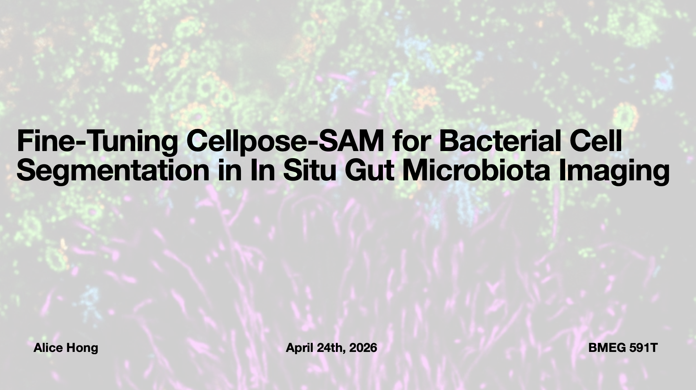
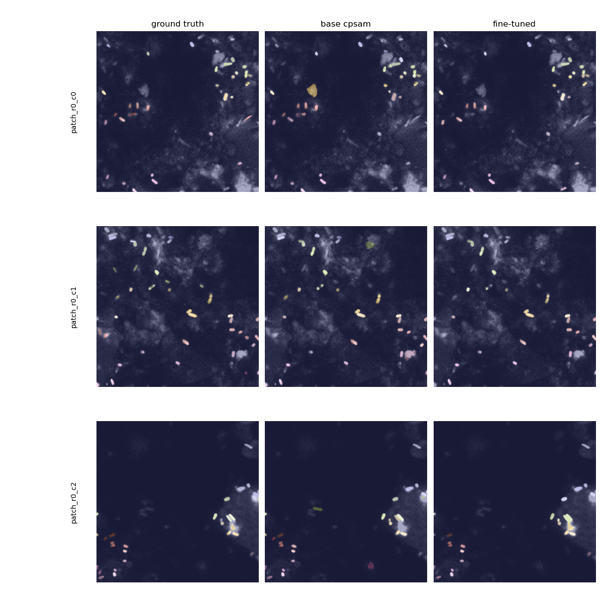
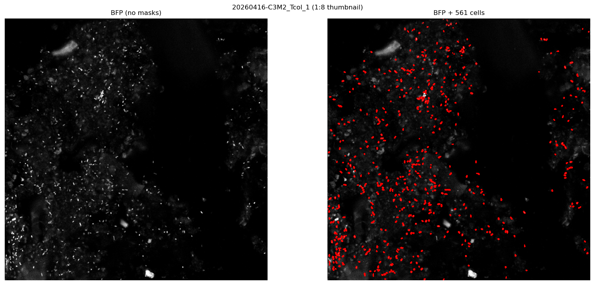

# Cellpose-Biosensor

Master repository for the biosensor quantification pipeline for in situ fluorescent bacterial images.

The pipeline segments single *E. coli* Nissle 1917 biosensor cells in confocal images of mouse colon sections using a fine-tuned
[Cellpose-SAM](https://github.com/MouseLand/cellpose) model. It then measures per-cell reporter activity (GFP/BFP for osmotic stress, RFP/BFP for oxidative stress).

- **Final report (BMEG591T):** [`files/FinalReport_withResults.pdf`](files/FinalReport_withResults.pdf)
- **Fine-tuned model:** [huggingface.co/aliceh0ng/cellpose-biosensor](https://huggingface.co/aliceh0ng/cellpose-biosensor)
- **Detailed step-by-step guide:** [`docs/pipeline_guide.md`](docs/pipeline_guide.md)

Presentation explaining how the fine-tuned model was trained (click to watch; slides in [`files/FinalSlides.pdf`](files/FinalSlides.pdf)):

[](https://youtu.be/ORrL1wdWfvk)

---

## How to run this pipeline

### 1. Clone the repository

```bash
git clone https://github.com/aliceh0ng/Cellpose-Biosensor.git
cd Cellpose-Biosensor
```

### 2. Set up the environment

```bash
# macOS (Apple Silicon, MPS)
conda env create -f environments/environment.yml
conda activate cellpose-biosensor

# Windows / Linux (NVIDIA, CUDA)
conda env create -f environments/environment_windows.yml
conda activate cellpose
```

If applicable, check that the GPU is visible:

```bash
python -c "import torch; print(torch.backends.mps.is_available(), torch.cuda.is_available())"
```

### 3. Pull the fine-tuned model from Hugging Face

The model weights are too large for GitHub, so `models/` is gitignored. They are hosted on the
[Hugging Face Hub](https://huggingface.co/aliceh0ng/cellpose-biosensor) instead:

```bash
python scripts/download_model.py                    # default: 4stacks_5x5_norm
```

This downloads `models/finetuned/<run>/` and writes the weight path to
`models/finetuned/latest_model_path.txt`, which `pipeline.py` reads automatically. If no model is found, the
pipeline falls back to the base `cpsam` model.

### 4. Add your images

Raw images are not in git. Put your 16-bit stacks in `data/raw/16bit_all/`:

```bash
mkdir -p data/raw/16bit_all
cp /path/to/your/*.tif data/raw/16bit_all/
```

For `.czi` files, [`scripts/open_czi_series.ijm`](scripts/open_czi_series.ijm) is a Fiji macro that exports the scenes as TIFF stacks.

### 5. Segment and measure

```bash
python scripts/pipeline.py --single YOUR_IMAGE.tif   # test on one image first
python scripts/pipeline.py                           # all images in data/raw/16bit_all/
```

For each image, the pipeline normalises the BFP channel, segments it with the fine-tuned model (diameter = 43 px),
removes objects outside 100–2000 px², and measures mean intensity in all four channels from the **raw uint16**
stack. Images that already have a CSV are skipped.

| Output | Description |
| --- | --- |
| `data/results/<name>.csv` | One row per cell: area, centroid, raw + background-subtracted intensities, `gfp_over_bfp`, `rfp_over_bfp` |
| `data/processed/<name>_masks.tif` | Final integer label mask (`_masks_raw.tif` = before size filter) |
| `figures/qc/<name>_masks_overview.png` | BFP thumbnail with cell outlines |
| `figures/qc/<name>_intensity_qc.svg` | BFP, GFP/BFP, RFP/BFP histograms |

To analyse the CSVs downstream, use the R template [`notebooks/Analysis_Template.Rmd`](notebooks/Analysis_Template.Rmd).
The same pipeline is available as a notebook in [`notebooks/06_segmentation_pipeline.ipynb`](notebooks/06_segmentation_pipeline.ipynb).
See [`docs/pipeline_guide.md`](docs/pipeline_guide.md) for all parameters and the CSV column reference.

---

## How the `4stacks_5x5_norm` model was trained

The model was fine-tuned from Cellpose-SAM (`cpsam`) using Cellpose's human-in-the-loop workflow. The scripts in
[`scripts/`](scripts/README.md) run in this order:

1. **Split stacks:** [`make_splits.py`](scripts/make_splits.py) randomly assigns whole image stacks to train / val / test
   (70 / 15 / 15, seed 42), written to `data/splits.json`. See [`data/splits_EXAMPLE.json`](data/splits_EXAMPLE.json).
2. **Generate initial masks:** [`inference_norm.py`](scripts/inference_norm.py) normalises the BFP channel globally
   (p1–p99 of the whole stitched image, so every patch uses the same intensity scale). It then splits each stack into a
   5×5 grid (~1265 × 1265 px patches) and runs base `cpsam` on each patch. Patches are saved with all 4 channels.
   ```bash
   python scripts/inference_norm.py --split train --n-rows 5 --n-cols 5
   ```
3. **Correct the masks by hand:** Each patch was reviewed in napari with all four channels. GFP, RFP, and SYTOX
   make it easier to reject autofluorescent debris and host cell fragments. Masks were corrected in the Cellpose GUI
   (`python -m cellpose`), and finished stacks were listed in `data/annotations.json`
   (see [`data/annotations_EXAMPLE.json`](data/annotations_EXAMPLE.json)).
4. **Fine-tune:** [`finetune.py`](scripts/finetune.py) calls `cellpose.train.train_seg()`. Annotated patches are split
   80/20 into internal train/validation sets, with all patches from one stack kept on the same side.
   ```bash
   python scripts/finetune.py --run-name 4stacks_5x5_norm --patches-dir data/patches/v2
   ```

BFP was the only channel given to the model during training. Hyperparameters follow the official Cellpose-SAM
training notebook:

| Parameter | Value |
| --- | --- |
| Optimizer | AdamW |
| Learning rate | 1e-5 |
| Weight decay | 0.1 |
| Batch size | 1 |
| Epochs | 100 |
| Diameter | 43 px (1.5 µm / 0.035 µm/px) |

**Results.** The model was trained on 4 annotated stacks (75 train patches, 25 internal validation patches, 3,913 cells).
It reached **AP@0.5 = 0.724** against **0.641** for base Cellpose-SAM on a held-out validation stack.

| Run | Patch size | Train patches | Cells | AP@0.5 base | AP@0.5 fine-tuned |
| --- | --- | --- | --- | --- | --- |
| `1stack` (pipeline test) | 2100 × 2100 | 7 | 361 | 0.712 | 0.741 |
| `5stacks` | 2100 × 2100 | 35 | 4,641 | 0.885 | 0.842 |
| **`4stacks_5x5_norm`** | 1265 × 1265 | 75 | 3,913 | 0.641 | **0.724** |

Base AP depends on how hard each run's validation stack is, so compare ΔAP across runs with caution. Training was
done on an NVIDIA GPU (CUDA 12.4 build, Cellpose 4.1.1, Python 3.10). Run metadata is in
`models/finetuned/4stacks_5x5_norm/run_info.json` once the model is downloaded.

---

## Description of dataset

Germ-free mice were monocolonized with an engineered *E. coli* Nissle 1917 biosensor strain carrying a low-copy
pSC101 plasmid with three reporters:

| Channel | Fluorophore | Promoter | Role |
| --- | --- | --- | --- |
| C1 (index 0) | mTagBFP2 | pJ23100 (constitutive) | Segmentation input + ratio denominator |
| C2 (index 1) | mGreenLantern (GFP) | pProV-Long (osmotic stress) | Reporter, measured as GFP/BFP |
| C3 (index 2) | mScarlet (RFP) | pAhpC (oxidative stress) | Reporter, measured as RFP/BFP |
| C4 (index 3) | SYTOX Far Red | — | Host nuclear stain |

Treatment mice received 15% PEG, then 2.5% and 5% DSS, and control mice received water. Colons were fixed in 4% PFA,
OCT-embedded, cryosectioned at 8–10 µm, and stained with SYTOX. For each mouse, 9 fields of view were imaged:
3 distal, 3 transverse and 3 proximal colon.

**Image format:**

| Property | Value |
| --- | --- |
| Microscope | Zeiss LSM 900 with Airyscan 2 (SR mode), Plan-Apochromat 100×/1.4 NA oil |
| Acquisition | 5×5 tile scan, stitched in ZEN |
| File | 16-bit TIFF, shape `(4, H, W)`, about 6,300 × 6,300 px (~221 × 221 µm) |
| Pixel size | 0.035 µm/px |
| Naming | `<date>-C<cage>M<mouse>_<region>col_<fov>.tif`, e.g. `20260416-C3M2_Tcol_1.tif` (D/P/T = distal/proximal/transverse) |

Use the **16-bit** export from ZEN, not the RGB preview. `src/io.py::load_stack()` raises an error if it receives an RGB image.

**Main challenges:** fecal autofluorescence (bright in BFP, GFP and RFP at once), uneven background from non-cleared
tissue, and small cells (~1.5 µm) in very large images.

---

## Example input and results

**Fine-tuned vs. base Cellpose-SAM** on validation patches (BFP channel). The fine-tuned model no longer segments the
large autofluorescent debris that base `cpsam` picks up, for example the blob at top left in `patch_r0_c0`:



**Whole-image pipeline output** for `20260416-C3M2_Tcol_1`: BFP input (left) and the 561 cells kept after size filtering (right):



Downstream GFP/BFP and RFP/BFP analyses by region, sex and treatment are in the
[final report](files/FinalReport_withResults.pdf).

---

## Repository structure

```
Cellpose-Biosensor/
├── data/            # raw/, patches/, processed/, results/ (contents not tracked)
├── docs/            # pipeline_guide.md: detailed how-to
├── environments/    # conda environments (macOS / Windows)
├── files/           # report, slides, README figures
├── models/          # fine-tuned weights, pulled from Hugging Face (gitignored)
├── notebooks/       # 00–06 exploration → pipeline, Analysis_Template.Rmd
├── scripts/         # make_splits → inference_norm → finetune → pipeline
└── src/             # io, preprocess, segment, measure
```

---

## Citation

If you use this pipeline or model, please cite Cellpose-SAM and Cellpose:

- Pachitariu, M., Rariden, M. & Stringer, C. **Cellpose-SAM: superhuman generalization for cellular segmentation.**
  *bioRxiv* (2025). https://doi.org/10.1101/2025.04.28.651001
- Pachitariu, M. & Stringer, C. **Cellpose 2.0: how to train your own model.** *Nature Methods* 19, 1634–1641 (2022).
  https://doi.org/10.1038/s41592-022-01663-4
- Stringer, C., Wang, T., Michaelos, M. & Pachitariu, M. **Cellpose: a generalist algorithm for cellular segmentation.**
  *Nature Methods* 18, 100–106 (2021). https://doi.org/10.1038/s41592-020-01018-x

```bibtex
@article{pachitariu2025cellposesam,
  title   = {Cellpose-SAM: superhuman generalization for cellular segmentation},
  author  = {Pachitariu, Marius and Rariden, Michael and Stringer, Carsen},
  journal = {bioRxiv},
  year    = {2025},
  doi     = {10.1101/2025.04.28.651001}
}
```
